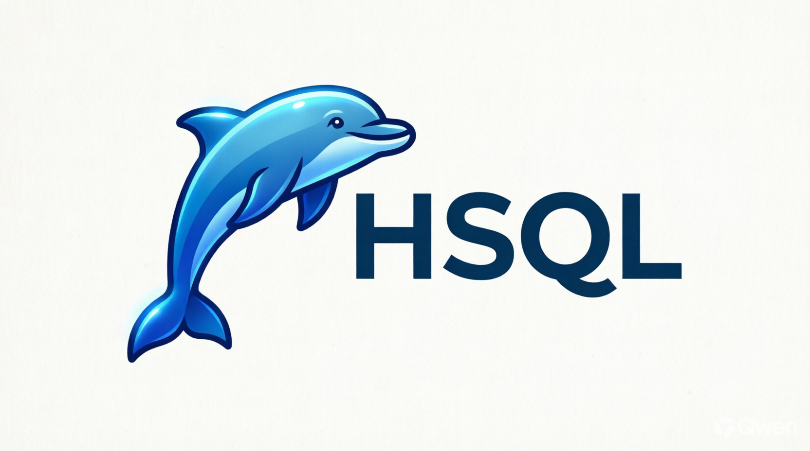

<div align="center">


# Relational Database




### A SQL database engine + browser UI, built from scratch in Node.js.

Hand-written lexer · Recursive-descent parser · Rule-based planner ·
B-Tree & Hash indexes · Transactions with WAL · Web console

[](LICENSE)
[](https://nodejs.org)
[](#)
[](#tests)
[](#docker)
[](CONTRIBUTING.md)

[Quick Start](#quick-start) ·
[Docker](#docker) ·
[Features](#features) ·
[Architecture](#architecture) ·
[Tests](#tests) ·
[Contributing](#contributing)

</div>

---

## What Is This?

A complete relational database engine written from scratch in plain JavaScript.

No ORMs. No query libraries. No npm dependencies.

Every layer is implemented from the ground up and can be opened, read, and modified:

* **Engine** — TCP server, wire protocol, connection state
* **SQL Frontend** — lexer, recursive-descent parser, AST
* **Planner** — rule-based optimizer with index selection
* **Executor** — operators for filtering, sorting, grouping, joins, aggregation, and windows
* **Storage** — databases, tables, typed columns, persisted rows
* **Indexes** — B-Tree for ranges, Hash for equality
* **Transactions** — sessions, undo log, write-ahead log, crash recovery
* **UI** — dark-mode browser console with editor, results, schema sidebar, history, and export

It's the whole stack, wired end to end.

---

## Quick Start

### Clone

```bash
git clone https://github.com/hr5656/sql-clone.git
cd sql-clone
```

### Start

```bash
npm run dev
```

You should see:

```text
[sql-clone] listening on tcp://0.0.0.0:5433
[web] http://localhost:8080
```

Open:

**http://localhost:8080**

---

## Try It in the Browser

```sql
CREATE TABLE users (
    id INT PRIMARY KEY,
    name TEXT,
    age INT
);

INSERT INTO users VALUES
    (1, 'alice', 30),
    (2, 'bob', 25),
    (3, 'carol', 40);

SELECT name, age
FROM users
WHERE age > 26
ORDER BY age DESC;
```

---

## Try It from the CLI

```bash
node client.js
```

Then run:

```sql
CREATE TABLE users (
    id INT PRIMARY KEY,
    name TEXT,
    age INT
);

INSERT INTO users VALUES
    (1, 'alice', 30),
    (2, 'bob', 25),
    (3, 'carol', 40);

SELECT * FROM users;
```

---

## Raw Socket

The database engine uses a length-prefixed TCP protocol.

```bash
printf '\x00\x00\x00\x12SELECT 1 + 2 AS three;' | nc -q 1 127.0.0.1 5433
```

---

# Docker

Run the complete stack — database engine + web UI — inside a container.

### Production

```bash
docker compose up -d --build
```

Web UI:

```text
http://localhost:8080
```

TCP engine:

```text
127.0.0.1:5433
```

Data persists in the `sql-clone-data` volume.

### Verify

```bash
curl -s http://localhost:8080/api/health
```

Example:

```json
{
  "ok": true,
  "sessions": 0
}
```

Check containers:

```bash
docker compose ps
```

Example:

```text
NAME         IMAGE              STATUS                   PORTS
sql-clone    sql-clone:latest   Up 3 seconds (healthy)   0.0.0.0:5433->5433/tcp, 0.0.0.0:8080->8080/tcp
```

### Development

Run with hot reload:

```bash
docker compose -f docker-compose.yml -f docker-compose.dev.yml up --build
```

Source files are bind-mounted, so changes to `src/` and `public/` reload automatically.

### Common Commands

```bash
docker compose logs -f
```

```bash
docker compose restart
```

```bash
docker compose down
```

Stop and remove the database volume:

```bash
docker compose down -v
```

Open a shell inside the container:

```bash
docker compose exec sql-clone sh
```

Check container health:

```bash
docker inspect --format='{{.State.Health.Status}}' sql-clone
```

### Docker Files

| File                     | Purpose                                               |
| ------------------------ | ----------------------------------------------------- |
| `Dockerfile`             | Single-stage Alpine build, non-root user, healthcheck |
| `docker-compose.yml`     | Production configuration                              |
| `docker-compose.dev.yml` | Development overlay with hot reload                   |
| `.dockerignore`          | Excludes `node_modules`, `data/`, `.git/`             |
| `.env.example`           | Documents environment variables                       |

The Docker image is approximately **55 MB**, runs as a non-root user, automatically restarts, and includes a healthcheck.

---

# Features

| Feature                                       |    Status   |
| --------------------------------------------- | :---------: |
| CREATE TABLE with types                       |      ✅      |
| PRIMARY KEY, UNIQUE, NOT NULL, DEFAULT        |      ✅      |
| INSERT single + multi-row                     |      ✅      |
| SELECT with projections + aliases             |      ✅      |
| WHERE, ORDER BY, LIMIT, OFFSET, DISTINCT      |      ✅      |
| CASE WHEN ... THEN ... ELSE ... END           |      ✅      |
| Arithmetic + comparison operators             |      ✅      |
| GROUP BY, HAVING                              |      ✅      |
| COUNT, SUM, AVG, MIN, MAX                     |      ✅      |
| INNER JOIN, LEFT JOIN, RIGHT JOIN, CROSS JOIN |      ✅      |
| UPDATE ... WHERE                              |      ✅      |
| DELETE ... WHERE                              |      ✅      |
| B-Tree + Hash indexes                         |      ✅      |
| CREATE INDEX                                  |      ✅      |
| CREATE UNIQUE INDEX                           |      ✅      |
| DROP INDEX                                    |      ✅      |
| EXPLAIN query plan                            |      ✅      |
| Common Table Expressions (WITH)               |      ✅      |
| Subqueries (IN, EXISTS, scalar)               |      ✅      |
| Window functions                              |      ✅      |
| Transactions                                  |      ✅      |
| Write-Ahead Log                               |      ✅      |
| Crash recovery                                |      ✅      |
| Multiple databases                            |      ✅      |
| DROP TABLE                                    |      ✅      |
| DROP DATABASE                                 |      ✅      |
| Browser UI                                    |      ✅      |
| Query autocomplete                            |      ✅      |
| Query history                                 |      ✅      |
| CSV / JSON export                             |      ✅      |
| Docker + Compose                              |      ✅      |
| Test suite                                    | **90/90** ✅ |

---

# Requirements

* Node.js **20+**
* Modern browser:

  * Chrome
  * Firefox
  * Edge
  * Safari
* Optional:

  * Docker
  * Docker Compose

No npm packages are required.

Use `.nvmrc` to select the required Node.js version:

```bash
nvm use
```

---

# SQL Reference

## DDL

### Create Table

```sql
CREATE TABLE users (
    id INT PRIMARY KEY,
    name TEXT NOT NULL,
    age INT DEFAULT 0,
    email TEXT UNIQUE
);
```

### Create Index

```sql
CREATE INDEX idx_users_age
ON users(age);
```

### Create Unique Index

```sql
CREATE UNIQUE INDEX idx_users_email
ON users(email);
```

### Drop Index

```sql
DROP INDEX idx_users_age;
```

### Drop Table

```sql
DROP TABLE users;
```

### Databases

```sql
CREATE DATABASE analytics;

USE analytics;

DROP DATABASE analytics;
```

---

# DML

## INSERT

```sql
INSERT INTO users
VALUES (1, 'alice', 30, 'a@x.com');
```

Multiple rows:

```sql
INSERT INTO users (id, name, age)
VALUES
    (2, 'bob', 25),
    (3, 'carol', 40);
```

## UPDATE

```sql
UPDATE users
SET age = age + 1
WHERE name = 'bob';
```

## DELETE

```sql
DELETE FROM users
WHERE age < 18;
```

---

# Queries

## Basic SELECT

```sql
SELECT *
FROM users;
```

## DISTINCT, ORDER BY, LIMIT, OFFSET

```sql
SELECT DISTINCT age
FROM users
ORDER BY age DESC
LIMIT 5 OFFSET 10;
```

## CASE

```sql
SELECT
    name,
    CASE
        WHEN age >= 30 THEN 'senior'
        ELSE 'junior'
    END AS bucket
FROM users;
```

## Aggregation

```sql
SELECT
    dept,
    COUNT(*) AS n,
    SUM(salary) AS total
FROM emp
GROUP BY dept
HAVING SUM(salary) > 100
ORDER BY total DESC;
```

## JOIN

```sql
SELECT
    emp.name,
    dept.name AS dept
FROM emp
INNER JOIN dept
    ON emp.dept_id = dept.id
WHERE emp.salary > 100
ORDER BY emp.name;
```

## CTE

```sql
WITH top AS (
    SELECT *
    FROM emp
    WHERE salary > 100
)
SELECT name
FROM top
ORDER BY name;
```

## Subquery

```sql
SELECT name
FROM emp
WHERE dept IN (
    SELECT dept
    FROM emp
    WHERE salary > 120
);
```

## Window Functions

```sql
SELECT
    name,
    dept,
    salary,
    ROW_NUMBER() OVER (
        PARTITION BY dept
        ORDER BY salary DESC
    ) AS rn
FROM emp;
```

---

# Transactions

## COMMIT

```sql
BEGIN;

UPDATE accounts
SET balance = balance - 100
WHERE id = 1;

UPDATE accounts
SET balance = balance + 100
WHERE id = 2;

COMMIT;
```

## ROLLBACK

```sql
BEGIN;

DELETE FROM users
WHERE age > 100;

ROLLBACK;
```

---

# EXPLAIN

Inspect the query plan:

```sql
EXPLAIN
SELECT *
FROM users
WHERE age > 30;
```

---

# Architecture

```text
┌────────────────────────────────────────────────────────┐
│  Browser / CLI                                         │
└───────────────────┬────────────────────────────────────┘
                    │ TCP :5433
                    │ Length-prefixed JSON
┌───────────────────▼────────────────────────────────────┐
│  TCP Server                                            │
│  TcpServer → Connection → Protocol                     │
│                                                       │
│  • frames messages                                     │
│  • handles sessions                                    │
│  • dispatches transactions                             │
│  • forwards SQL to executor                            │
└───────────────────┬────────────────────────────────────┘
                    │
┌───────────────────▼────────────────────────────────────┐
│  SQL Frontend                                          │
│                                                       │
│  Lexer → Parser → AST                                  │
└───────────────────┬────────────────────────────────────┘
                    │
┌───────────────────▼────────────────────────────────────┐
│  Query Processing                                      │
│                                                       │
│  Planner → Optimizer → Operators                       │
│                                                       │
│  SELECT / INSERT / UPDATE / DELETE                    │
│  JOIN / GROUP / SORT / AGGREGATE / WINDOW             │
└───────────────────┬────────────────────────────────────┘
                    │
┌───────────────────▼────────────────────────────────────┐
│  Storage Engine                                        │
│                                                       │
│  Database → Table → Column / Row                       │
│  IndexManager → B-Tree / Hash                         │
└───────────────────┬────────────────────────────────────┘
                    │
┌───────────────────▼────────────────────────────────────┐
│  Transaction Layer                                     │
│                                                       │
│  Session → Transaction → WAL → Recovery               │
└───────────────────┬────────────────────────────────────┘
                    │
┌───────────────────▼────────────────────────────────────┐
│  Disk                                                  │
│                                                       │
│  data/<db>/<table>.tbl                                │
│  data/<db>.wal                                        │
└────────────────────────────────────────────────────────┘
```

---

# Wire Protocol

Every TCP message uses:

```text
[4 bytes big-endian length][UTF-8 payload]
```

### Request

The payload contains a SQL string.

Example:

```sql
SELECT 1 + 2 AS three;
```

### Successful Response

```json
{
  "ok": true,
  "kind": "select",
  "rowCount": 2,
  "rows": []
}
```

### Error Response

```json
{
  "ok": false,
  "code": "PARSE_ERROR",
  "error": "Expected '(', got ',' at 34"
}
```

---

# Storage Format

Tables are persisted under:

```text
data/<database>/<table>.tbl
```

Example:

```json
{
  "name": "users",
  "columns": [
    {
      "name": "id",
      "type": "INT",
      "nullable": false,
      "primaryKey": true
    },
    {
      "name": "name",
      "type": "TEXT",
      "nullable": false
    }
  ],
  "rows": [
    {
      "id": 1,
      "name": "alice"
    },
    {
      "id": 2,
      "name": "bob"
    }
  ],
  "indexes": [
    {
      "name": "idx_users_name",
      "column": "name",
      "kind": "BTREE",
      "unique": false
    }
  ]
}
```

### Write-Ahead Log

WAL files are stored as append-only JSONL:

```text
data/<database>.wal
```

Example:

```json
{"type":"BEGIN","txId":1,"ts":...}
{"type":"MUTATE","txId":1,"table":"users","rows":[...],"ts":...}
{"type":"COMMIT","txId":1,"ts":...}
```

On startup, the server checks the WAL for incomplete transactions.

If the final transaction record is not `COMMIT` or `ROLLBACK`, the server detects the crashed transaction and performs recovery.

---

# Project Layout

```text
sql-clone/
│
├── package.json
├── README.md
├── Dockerfile
├── docker-compose.yml
├── docker-compose.dev.yml
├── .dockerignore
├── .env.example
├── .nvmrc
├── client.js
│
├── data/
│   └── runtime databases
│
├── public/
│   ├── index.html
│   ├── style.css
│   ├── app.js
│   └── media/
│       └── logo.png
│
├── docs/
│   ├── architecture.md
│   ├── sql_grammar.ebnf
│   └── phase_notes.md
│
├── tests/
│   ├── helpers.js
│   └── phase*.test.js
│
└── src/
    ├── index.js
    │
    ├── server/
    │   ├── tcpServer.js
    │   ├── connection.js
    │   ├── protocol.js
    │   ├── databaseManager.js
    │   └── webServer.js
    │
    ├── storage/
    │   ├── database.js
    │   ├── table.js
    │   ├── column.js
    │   ├── row.js
    │   ├── page.js
    │   ├── diskManager.js
    │   ├── walRecovery.js
    │   ├── constraints/
    │   └── index/
    │
    ├── sql/
    │   ├── lexer/
    │   ├── parser/
    │   ├── ast/
    │   └── executor/
    │       └── operators/
    │
    ├── transaction/
    │   ├── transaction.js
    │   ├── session.js
    │   ├── lockManager.js
    │   └── wal.js
    │
    └── common/
        ├── errors.js
        ├── types.js
        └── utils.js
```

---

# Web UI

| Region      | Purpose                                               |
| ----------- | ----------------------------------------------------- |
| Topbar      | Logo, database picker, connection status, new session |
| Left Rail   | Query history and table/schema browser                |
| Query Pane  | SQL editor and autocomplete                           |
| Result Pane | Query results and CSV/JSON export                     |
| Footer      | Project information                                   |

### Keyboard Shortcuts

| Shortcut           | Action             |
| ------------------ | ------------------ |
| `Ctrl / ⌘ + Enter` | Run query          |
| `Ctrl / ⌘ + Space` | Autocomplete       |
| `Tab`              | Insert two spaces  |
| `Esc`              | Close autocomplete |

---

# Session Model

Each browser tab receives a stable session ID through `sessionStorage`.

The session ID maps to one persistent TCP socket on the web server.

Transactions are isolated by session:

```text
Browser Tab A
     │
     └── Session A ── TCP Socket A

Browser Tab B
     │
     └── Session B ── TCP Socket B
```

A transaction started in one browser tab does not affect another session.

Use **New Session** to close the existing socket and start a fresh session.

---

# Tests

The project currently contains **90 tests**.

Run the complete test suite:

```bash
npm test
```

Example output:

```text
# tests 90
# suites 1
# pass 90
# fail 0
# duration_ms 3620.84
```

### Test Coverage

| Test File                      | Tests | Coverage                                    |
| ------------------------------ | ----: | ------------------------------------------- |
| `phase1_server.test.js`        |     5 | TCP server, framing, concurrency            |
| `phase2_parser.test.js`        |    20 | Lexer, parser, AST                          |
| `phase3_crud.test.js`          |    12 | CREATE, INSERT, UPDATE, DELETE, persistence |
| `phase4_clauses.test.js`       |    10 | WHERE, ORDER BY, LIMIT, DISTINCT, CASE      |
| `phase5_aggregates.test.js`    |     8 | COUNT, SUM, AVG, MIN, MAX, GROUP BY, HAVING |
| `phase6_joins.test.js`         |     6 | INNER, LEFT, RIGHT, CROSS                   |
| `phase7_constraints.test.js`   |     7 | PRIMARY KEY, UNIQUE, NOT NULL, DEFAULT      |
| `phase8_indexes.test.js`       |     9 | B-Tree, Hash, EXPLAIN, persistence          |
| `phase9_advanced.test.js`      |    13 | CTEs, subqueries, window functions          |
| `phase10_transactions.test.js` |     8 | BEGIN, COMMIT, ROLLBACK, WAL                |

Run an individual test file:

```bash
node --test tests/phase3_crud.test.js
```

---

# Node.js Version

The test suite uses Node.js features such as:

* `node:test`
* `before()`
* `--test-reporter=spec`

Node.js **20.6+** is recommended.

If the test suite fails because of an unsupported test runner option:

```bash
nvm install 20
nvm use 20
```

The `.nvmrc` file in the repository root pins the expected version.

Then:

```bash
nvm use
```

---

# Development

Start the development server:

```bash
npm run dev
```

Watch the server terminal for:

```text
[sql]
```

and:

```text
[sql error]
```

messages.

### Reset All Data

To remove all local database data:

```bash
rm -rf data
```

---

# Configuration

| Variable   |   Default | Purpose                  |
| ---------- | --------: | ------------------------ |
| `PORT`     |    `5433` | TCP database engine port |
| `WEB_PORT` |    `8080` | HTTP web UI port         |
| `HOST`     | `0.0.0.0` | Server bind address      |

Example:

```bash
WEB_PORT=9090 npm run dev
```

---

# Known Limitations

This project intentionally keeps the implementation simple right now.

* Single-process, single-machine
* No replication or clustering
* Isolation is per connection, not MVCC
* Two sessions writing the same table can see each other's uncommitted changes
* FOREIGN KEY and CHECK enforcement is partial
* Cost-based query planning is not implemented
* Query optimizer is rule-based
* Index metadata is persisted, while index structures are rebuilt on startup
* No `ALTER TABLE`
* No streaming query results
* Result sets are materialized in memory

---

# Non-Goals

This project does **not** aim to provide:

* PostgreSQL wire compatibility
* MySQL wire compatibility
* Full SQL-92 compliance
* Distributed execution
* Complete ACID implementation with two-phase commit

The goal is to understand how a relational database works internally by implementing its major components from scratch.

---

# Contributing

See `CONTRIBUTING.md`.

Small, focused pull requests are welcome.

### Good First Issues

* Add `ALTER TABLE ... ADD COLUMN`
* Implement cost-based join reordering
* Persist B-Tree structures to disk
* Add streaming `SELECT` results
* Add `LIKE` operator
* Add `DATE` and `TIMESTAMP` types

---

# License

MIT — see [LICENSE](LICENSE).

Free to use, modify, and ship.

---

<div align="center">

### Harshit Rajput

If this project helped you understand how databases work, a ⭐ goes a long way.

</div>
